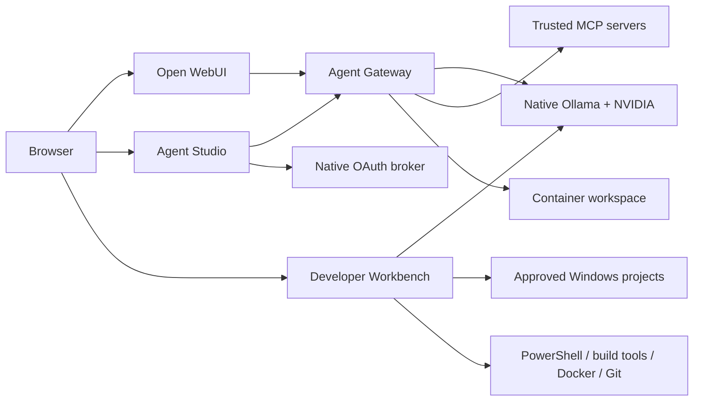

# DSAlgo Local AI Setup

A guided, local-first AI workstation for Windows. DSAlgo Local AI Setup helps
you discover and run local LLMs that fit your machine, combining native
Windows Ollama, Open WebUI, reusable agents/MCP, and an approval-gated Windows
Developer Workbench. Cloud LLMs are not used by default. Services are intended
for the local machine, not public or LAN hosting.

The installer detects the target machine's hardware and generates resource and
model choices for that machine. The currently validated path is Windows 11
with a known NVIDIA CUDA GPU, dedicated VRAM, adequate RAM and disk, WSL2,
Docker Desktop, and native Ollama. Other hardware may work but remains
controlled beta until the hardware matrix is validated.
It asks you to confirm hardware and recommends verified Ollama models for
General Conversation, Reasoning, Coding, Deep Research, or All. The confirmed
result controls model downloads and creates enabled sample general, coding,
and deep-research agents.

## Current validation status

This is a capable local workstation distribution, but it should currently be
treated as controlled-beta software rather than a universal installer. Disk
eligibility, GPU placement, Docker/WSL allocation, lifecycle recovery, and
end-to-end model/tool behavior still need broader representative-machine
validation. A public release should add a blocking preflight report,
post-install readiness checks, and a versioned compatibility matrix.

## What it enables

- Guided exploration of local models with deterministic, machine-aware selection.
- Local chat, attachments, documents, and knowledge collections through Open WebUI.
- Reusable agents with scoped tools and trusted MCP services.
- A native OAuth broker and least-privilege MCP credential boundary; external
  providers remain external dependencies and must be reviewed.
- Human-approved Windows development: explicit project roots, proposed patches
  and commands, and approval before impactful actions.
- Online, Restricted Online, and Strict Offline application policies. Strict
  Offline is not an operating-system firewall or air-gap guarantee.
- Install, start, stop, health, repair, backup, remove, and uninstall lifecycle
  operations.

## Who it is for

- Windows users who want local LLMs without assembling every component.
- Developers who want local coding assistance with explicit review gates.
- Privacy-conscious users who want local inference as the default.
- Tinkerers who want a stable base for models, agents, and MCP.

It is not currently for public hosting, multi-user tenancy, enterprise SSO,
shared deployments, fully unattended coding automation, or a guarantee of
broad hardware/model compatibility.

## Why this exists

Upstream tools each solve important problems. This distribution focuses on
their integration: guided Windows installation, capability-aware model
selection, lifecycle operations, localhost-first deployment, least-privilege
agent tools, MCP credential boundaries, connectivity policy, and approval-gated
native code execution. Open WebUI is a deliberate foundation of this stack,
not a competing product being replaced.

## What is included

| Interface | URL | Purpose |
|---|---|---|
| Open WebUI | `http://localhost:3000` | Local chat, model/agent selection, documents, and knowledge collections |
| Local Agent Studio | `http://localhost:3001` | Agent instructions, backing Ollama models, preferred-use roles, tools, MCP, OAuth, and status |
| Developer Workbench | `http://localhost:3002` | Approved Windows projects, AI change tasks, patch/command approval, and Git |

Supporting services:

- Native Windows Ollama at `localhost:11434`
- OpenAI-compatible local Agent Gateway at `localhost:8001`
- Native loopback MCP OAuth broker at `localhost:3003`

## Architecture at a glance



Studio and Workbench intentionally remain separate. Studio manages reusable
agent capability; Workbench is a higher-trust native coding and Git surface.

## Documentation

Choose the guide for your task:

- [user-guide.md](user-guide.md) — beginner-friendly installation, everyday
  use, agents, MCP, coding workflows, backup, and troubleshooting.
- [dev-guide.md](dev-guide.md) — architecture, diagrams, source layout,
  technology stack, APIs, security, development, testing, hooks, and commits.
- [agentic-dev-instructions.md](agentic-dev-instructions.md) — reusable
  repository standards used by maintainers and automated development tools.
- [decision-log.md](decision-log.md) — accepted functionality and architecture
  decisions.
- [to-do.md](to-do.md) — known limitations and future work.
- [SECURITY.md](SECURITY.md) — security posture and reporting.
- [CHANGELOG.md](CHANGELOG.md) — version history.

The comparison guide is [compare-similar-tools.md](compare-similar-tools.md).

## Quick installation

Extract the public release package and run `install.exe` as Administrator.
Accept the displayed license notice, review the detected hardware, choose the
models, and confirm installation in the wizard. If Windows must restart, sign
in again and rerun `install.exe`; progress is saved and resumes safely.

The installer adds missing WSL2, Python, Ollama, and Docker Desktop
prerequisites, downloads configured models, builds images, creates stopped
containers, detects the Windows system time zone for container-local time, and
adds Desktop/Start Menu shortcuts.

Start with `start.exe` or its installed shortcut. The UAC prompt elevates only
Docker/container startup. Workbench and OAuth run as the signed-in,
non-Administrator user, and the launcher opens the three local interfaces.

Read the complete [installation walkthrough](user-guide.md#4-first-installation)
before installing on a new machine.

## Hardware and model support

The distribution helps select models that fit a machine; a downloadable model
is not automatically supported or suitable. Recommendations are deterministic
and do not prove driver compatibility, performance, disk capacity, or model
availability. Bring-your-own Ollama models are welcome, but they are
user-managed unless validated here; unknown-model capabilities, resource use,
and performance are not guaranteed.

| Tier | Meaning |
|---|---|
| Validated | Windows 11, known NVIDIA CUDA GPU with dedicated VRAM, WSL2, Docker Desktop, native Windows Ollama, and sufficient RAM/disk—the current primary tested path. |
| Compatible | A documented profile appears to meet catalog/resource constraints, but the complete path has not been validated on that machine. |
| Experimental | A controlled investigation or partial test exists; failures and missing capabilities are possible. |
| Unsupported | No supported distribution path is claimed. |

AMD, Intel, CPU-only, Vulkan, DirectML, unknown-VRAM, multi-GPU,
non-Windows, and other paths remain validation work unless explicitly promoted
by the project documentation.

## Build a release

Use Windows PowerShell 5.1 or PowerShell 7:

```powershell
powershell -ExecutionPolicy Bypass -File .\build\build.ps1
```

The build automatically runs `pnpm --dir frontend build`, then installs PS2EXE
for the current user if needed, packages and signs
the GUI installer and lifecycle executables, and writes checksums and
verification instructions to `dist`. The certificate is self-signed and not
publicly trusted; SmartScreen or Unknown Publisher warnings are expected.
The protected GitHub release workflow publishes the complete `dist` directory,
including `payload`, as an extractable release ZIP. Extract the ZIP as a whole
before running `install.exe`.

## Lifecycle summary

| Command | Effect |
|---|---|
| `install.exe` | Install or resume prerequisites and create stopped services |
| `start.exe` | Start selected services with the correct privilege split |
| `stop.exe` | Stop services and retain containers/data |
| `repair.exe` | Rebuild and recreate services, leaving them stopped |
| `remove.exe` | Remove containers/services and retain durable data/configuration |
| `uninstall.exe` | Confirmed, ownership-aware uninstall with optional purge of installer-owned images, volumes, and models |

## Operating modes

One setting is shared by Studio and Workbench:

- **Online:** all configured connectivity is allowed.
- **Restricted Online:** local AI stays private while approved build, package,
  Docker, and Git connectivity remains available.
- **Strict Offline:** project-controlled internet-dependent AI, MCP, OAuth,
  remote Git, download, and unbounded command features are disabled.

Strict Offline is not an operating-system firewall. Open WebUI plugins,
unrelated Windows processes, or independently configured connections require
separate network controls.

## Default models

| Role | Ollama model |
|---|---|
| General | `qwen3:14b-q4_K_M` |
| Coder | `qwen2.5-coder:14b-instruct-q4_K_M` |
| Reasoning | `deepseek-r1:14b-qwen-distill-q4_K_M` |
| Embedding | `embeddinggemma:latest` |

`config/models.json` is the source of truth.

## Configuration and privacy

Tracked active configuration is a generic first-install baseline with no
custom agents, MCP servers, or approved project paths. Machine-specific
non-secret snapshots use ignored `config/personal-*` files.

Never commit:

- `.env`;
- DPAPI secret or OAuth stores;
- `config/personal-*`;
- runtime state and tokens;
- logs and backups;
- benchmark output;
- local project paths or credentials.

Before publishing:

```powershell
.\Test-GitSafety.ps1
```

## Security boundary

- Local ports are not intended for public exposure.
- Gateway containers run without root, drop capabilities, have no Docker
  socket, and restrict agent files to `workspace/`.
- Workbench accepts only explicit project roots and approval-gates writes,
  deletion, commands, commits, and push.
- OAuth grants are encrypted with Windows DPAPI.
- MCP servers are privileged integrations; connect only trusted providers with
  least privilege.
- Generated code and commands must be reviewed before commit or push.

See [SECURITY.md](SECURITY.md) and the
[development security model](dev-guide.md#7-trust-boundaries).

## Current scope

Version 5 prioritizes a dependable local agent workstation. It does not attempt
to be a multi-user cloud service, general workflow canvas, enterprise connector
platform, durable distributed task system, independent MCP proxy, or complete
observability suite.
## License and third-party components

The project is released under the MIT License in [`LICENSE`](LICENSE). The
installer displays that license and a required third-party notice before any
installation changes are made. Open-source dependencies, container images,
runtime software, and AI models remain governed by their respective owners'
licenses and terms; this project does not claim ownership or warranty for
those components.
