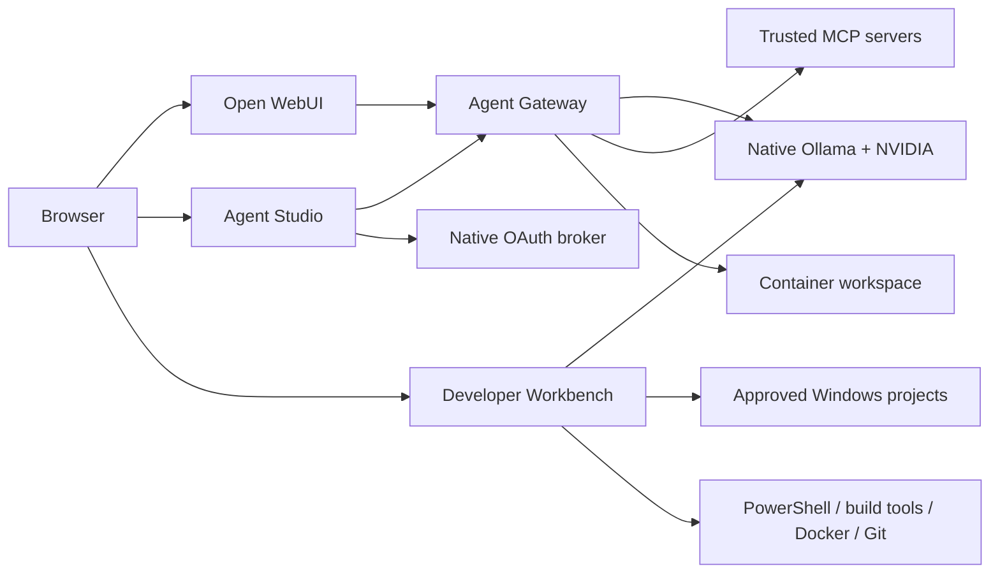

# Alienware Local AI

A local-first AI workstation for Windows 11, native NVIDIA-accelerated Ollama,
Open WebUI chat, reusable tool/MCP agents, and an approval-gated Windows
Developer Workbench.

This repository targets an Alienware Area-51 laptop with an RTX 5090 Laptop GPU
(24 GB VRAM) and 64 GB RAM. Its model and WSL defaults may require adjustment
on other hardware.

## What is included

| Interface | URL | Purpose |
|---|---|---|
| Open WebUI | `http://localhost:3000` | Local chat, model/agent selection, documents, and knowledge collections |
| Local Agent Studio | `http://localhost:3001` | Agent instructions, model roles, tool permissions, MCP, OAuth, and status |
| Developer Workbench | `http://localhost:3002` | Approved Windows projects, AI change tasks, patch/command approval, and Git |

Supporting services:

- Native Windows Ollama at `localhost:11434`
- OpenAI-compatible local Agent Gateway at `localhost:8001`
- Native loopback MCP OAuth broker at `localhost:3003`
- Optional Temporal UI at `localhost:8088`

## Architecture at a glance



Studio and Workbench intentionally remain separate. Studio manages reusable
agent capability; Workbench is a higher-trust native coding and Git surface.

## Documentation

Choose the guide for your task:

- [user-guide.md](user-guide.md) — beginner-friendly installation, everyday
  use, agents, MCP, coding workflows, backup, and troubleshooting.
- [dev-guide.md](dev-guide.md) — architecture, diagrams, source layout,
  technology stack, APIs, security, development, testing, hooks, and commits.
- [agentic-dev-instructions.md](agentic-dev-instructions.md) — reusable
  persistent instructions for Claude, Codex, or another coding agent.
- [docs/PROJECT_CONTEXT.md](docs/PROJECT_CONTEXT.md) — project mission, history,
  scope, and design context.
- [decision-log.md](decision-log.md) — accepted functionality and architecture
  decisions.
- [to-do.md](to-do.md) — known limitations and future work.
- [SECURITY.md](SECURITY.md) — security posture and reporting.
- [CHANGELOG.md](CHANGELOG.md) — version history.

## Quick installation

Open Windows PowerShell as Administrator:

```powershell
Set-ExecutionPolicy -Scope Process Bypass
Set-Location -LiteralPath 'C:\self-hosted-setup\dsalgo-local-ai-setup'
.\Install.ps1
```

If Windows must restart, sign in and rerun the same command. Installation
progress is saved and resumes safely.

The installer adds missing WSL2, Python, Ollama, and Docker Desktop
prerequisites, downloads configured models, builds images, creates stopped
containers, and adds Desktop/Start Menu shortcuts.

Start from a normal non-Administrator PowerShell window:

```powershell
Set-ExecutionPolicy -Scope Process Bypass
.\Start.ps1 -OpenBrowser
```

The UAC prompt elevates only Docker/container startup. Workbench and OAuth run
as the signed-in, non-Administrator user.

Optional installation/start profiles:

```powershell
.\Install.ps1 -WithTemporal
.\Install.ps1 -WithExtendedServices
.\Start.ps1 -WithTemporal -WithExtendedServices -OpenBrowser
```

Read the complete [installation walkthrough](user-guide.md#4-first-installation)
before installing on a new machine.

## Lifecycle summary

| Command | Effect |
|---|---|
| `Install.ps1` | Install/resume prerequisites, build, and create stopped services |
| `Start.ps1` | Start selected services with the correct privilege split |
| `Stop.ps1` | Stop services and retain containers/data |
| `Repair.ps1` | Rebuild and recreate services, leaving them stopped |
| `Remove.ps1` | Remove containers/services and retain durable data/configuration |
| `Uninstall.ps1` | Confirmed, ownership-aware uninstall |
| `Health.ps1` | Check service health |
| `Backup.ps1` | Back up supported project state |

## Operating modes

One setting is shared by Studio and Workbench:

- **Online:** all configured connectivity is allowed.
- **Restricted Online:** local AI stays private while approved build, package,
  Docker, and Git connectivity remains available.
- **Strict Offline:** project-controlled internet-dependent AI, MCP, OAuth,
  remote Git, download, and unbounded command features are disabled.

Strict Offline is not an operating-system firewall. Open WebUI plugins,
unrelated Windows processes, or independently configured connections require
separate network controls.

## Default models

| Role | Ollama model |
|---|---|
| General | `qwen3:14b-q4_K_M` |
| Coder | `qwen2.5-coder:14b-instruct-q4_K_M` |
| Reasoning | `deepseek-r1:14b-qwen-distill-q4_K_M` |
| Embedding | `embeddinggemma:latest` |

`config/models.json` is the source of truth.

## Configuration and privacy

Tracked active configuration is a generic first-install baseline with no
custom agents, MCP servers, or approved project paths. Machine-specific
non-secret snapshots use ignored `config/personal-*` files.

Never commit:

- `.env`;
- DPAPI secret or OAuth stores;
- `config/personal-*`;
- runtime state and tokens;
- logs and backups;
- benchmark output;
- local project paths or credentials.

Before publishing:

```powershell
.\Test-GitSafety.ps1
```

## Security boundary

- Local ports are not intended for public exposure.
- Gateway containers run without root, drop capabilities, have no Docker
  socket, and restrict agent files to `workspace/`.
- Workbench accepts only explicit project roots and approval-gates writes,
  deletion, commands, commits, and push.
- OAuth grants are encrypted with Windows DPAPI.
- MCP servers are privileged integrations; connect only trusted providers with
  least privilege.
- Generated code and commands must be reviewed before commit or push.

See [SECURITY.md](SECURITY.md) and the
[development security model](dev-guide.md#7-trust-boundaries).

## Current scope

Version 5 prioritizes a dependable local agent workstation. It does not attempt
to be a multi-user cloud service, general workflow canvas, enterprise connector
platform, durable distributed task system, independent MCP proxy, or complete
observability suite.
