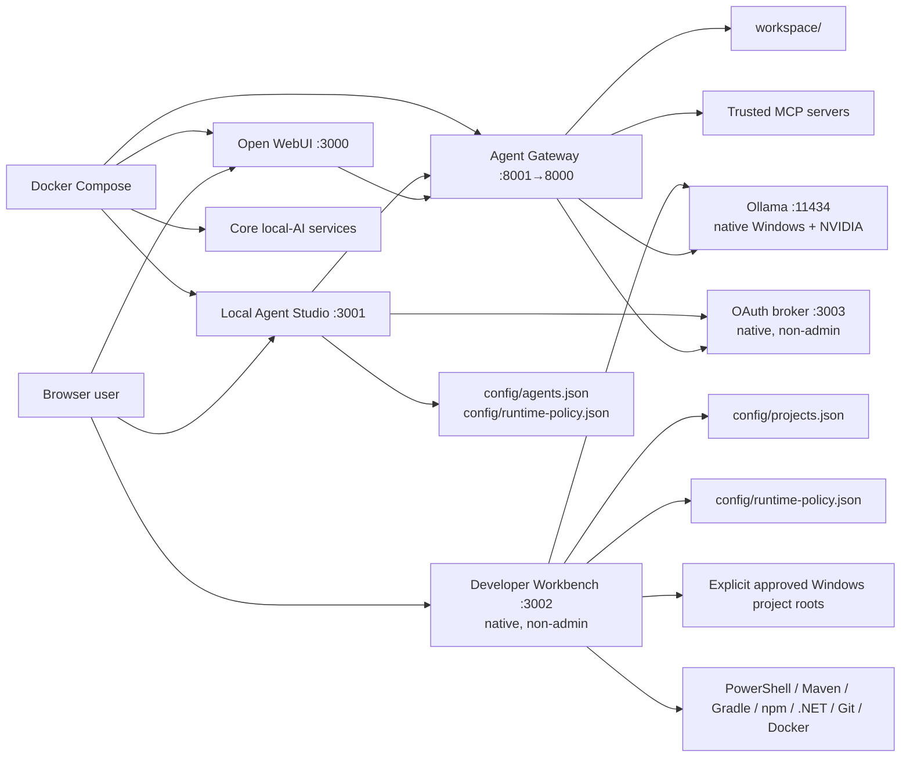
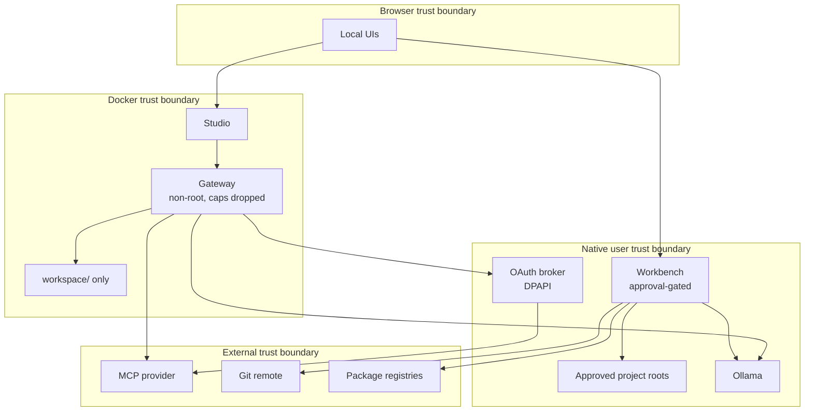
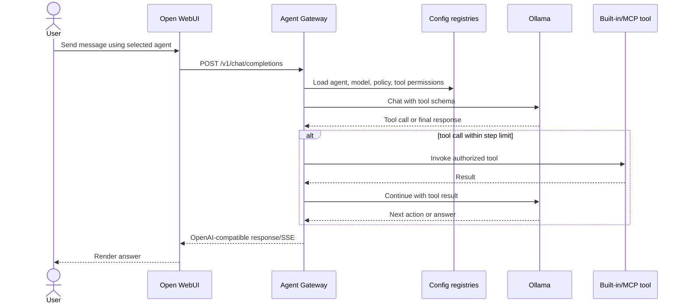
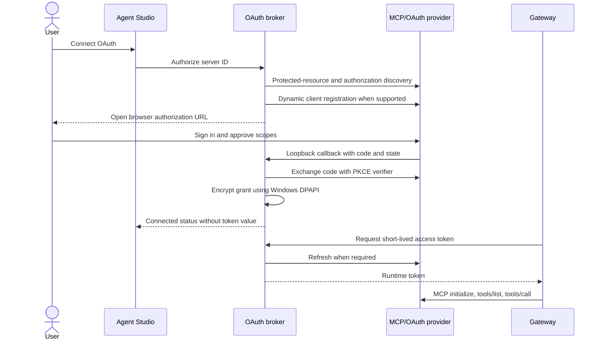
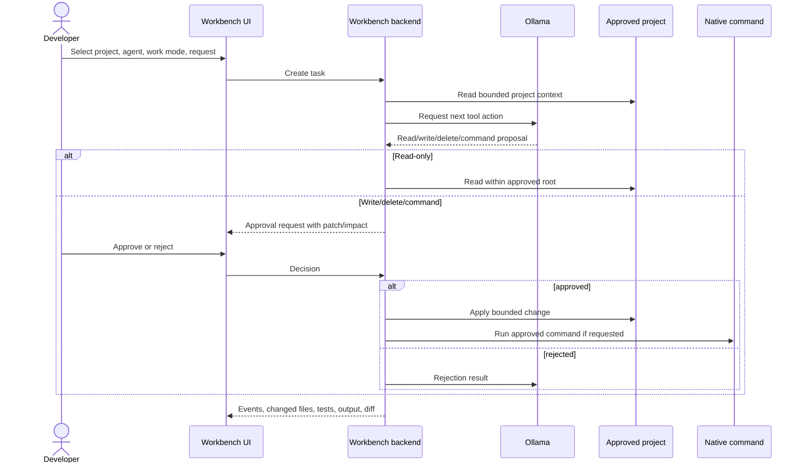
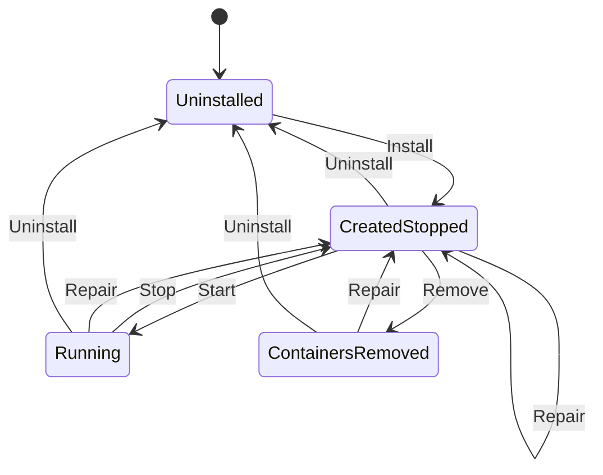

# DSAlgo Local AI Setup Development Guide

This is the authoritative architecture and contributor guide for DSAlgo Local
AI Setup. It is written for developers changing the Python services, Svelte
applications, PowerShell lifecycle, Docker topology, model configuration, MCP
integration, or security boundaries.

For installation and ordinary use, see [user-guide.md](user-guide.md). Coding
agents should also load
[agentic-dev-instructions.md](agentic-dev-instructions.md).

## Current release caveats

The public installer uses deterministic, inference-free scoring over the
versioned Ollama catalog. `config/models.json` in an installed copy is
generated from the one-to-three models selected in the wizard; the repository
template is not a universal hardware guarantee. Docker Compose remains a
static core service topology because Ollama runs natively on Windows.

The currently validated path is Windows/NVIDIA CUDA hardware with known VRAM.
AMD, Intel, CPU-only, Vulkan, DirectML, unknown-VRAM, multi-GPU, and
non-Windows compatibility remain validation work. Catalog values are planning
estimates until measured on the target backend. See [`to-do.md`](to-do.md) and
decision D-039 before describing this as a production-wide installer.

## 1. Project goals and scope

The project turns one Windows 11 workstation into a local AI environment with:

- native GPU-accelerated Ollama models;
- Open WebUI chat and document interaction;
- reusable tool-enabled agents;
- Streamable HTTP MCP integrations with static or OAuth authentication;
- an approval-gated native Windows coding workbench;
- explicit Online, Restricted Online, and Strict Offline operating modes;
- the core local-AI services only.

Version 5 favors a reliable local agent stack over a general workflow platform.
Workflow canvases, enterprise connector catalogs, scheduling, multi-user
tenancy, an independent MCP proxy, and a full observability suite are deliberate
non-goals unless a future decision changes scope.

## 2. Documentation map

| File | Audience | Authority |
|---|---|---|
| `README.md` | Everyone | Concise landing page, quick start, URLs, and guide links |
| `user-guide.md` | Operators and beginners | Installation, configuration, usage, backup, recovery, and troubleshooting |
| `dev-guide.md` | Contributors | Architecture, source code, APIs, development, testing, and commits |
| `agentic-dev-instructions.md` | Coding agents | Persistent invariants, security rules, documentation contract, hooks, and validation |
| `docs/PROJECT_CONTEXT.md` | Maintainers | Mission, design history, system map, scope, and enhancement priorities |
| `decision-log.md` | Maintainers | Accepted and superseded technical/product decisions with rationale |
| `to-do.md` | Maintainers | Known limitations, gaps, tradeoffs, and future work |
| `CHANGELOG.md` | Users and maintainers | Versioned user-visible changes and resolved limitations |
| `SECURITY.md` | Users and security reviewers | Threat model and vulnerability reporting |
| `.env.example` | Operators and developers | Public environment-variable contract without secrets |
| `AGENTS.md` | Repository coding agents | Repository-specific execution rules; kept aligned with the reusable agent instructions |

Documentation changes are part of implementation, not a later cleanup task.

## 3. Complete technology stack

### Host platform

- Windows 11
- PowerShell 5.1-compatible lifecycle scripts
- WSL2 and Docker Desktop
- Native Ollama for direct NVIDIA access
- NVIDIA RTX 5090 Laptop GPU with 24 GB VRAM
- 64 GB system RAM, with at least 24 GB reserved outside Docker/WSL by default
- Native Python 3.12 or compatible Python 3 for Workbench and OAuth broker

### Container application plane

- Docker Compose
- Open WebUI
- Python 3 / FastAPI Agent Gateway
- Python 3 / FastAPI Local Agent Studio backend
- Uvicorn
- HTTPX for Ollama, MCP, and service requests
- Docker Compose core services only

### Native application plane

- Python standard-library HTTP service for Developer Workbench
- Python standard-library HTTP service for MCP OAuth broker
- Windows DPAPI through `ctypes`
- Native Git and developer toolchains invoked in approved projects

### Frontend

- Svelte 5
- TypeScript 5
- Vite 7
- `lucide-svelte`
- Shared local components and CSS custom-property design system
- pnpm with a lockfile and an explicit esbuild build-script allow-list

### Protocols and contracts

- OpenAI-compatible `/v1/models` and `/v1/chat/completions`
- Ollama native chat and model APIs
- MCP Streamable HTTP
- OAuth 2.1 Authorization Code with PKCE
- OAuth protected-resource and authorization-server discovery
- Loopback HTTP APIs for Studio, Workbench, and OAuth broker

## 4. Development prerequisites

Install or make available:

1. Windows 11 with virtualization enabled.
2. PowerShell 5.1 or PowerShell 7.
3. WSL2.
4. Docker Desktop using the WSL2 backend.
5. Ollama for Windows.
6. Python 3.12+ on Windows.
7. Node.js compatible with Vite 7.
8. pnpm 11.
9. Git.
10. Optional toolchains used by Workbench tests: Maven, Gradle, npm, .NET SDK,
    Java, or Docker CLI.

Do not rely on Node at production runtime. Compiled frontend assets are
committed so the installed Python services can serve them directly.

## 5. Architecture overview



### Why Studio and Workbench are separate

Studio is a lower-trust configuration plane. It edits reusable agent
instructions, model roles, tool permissions, and MCP assignments for gateway
chat. Workbench is a higher-trust execution plane with arbitrary approved
Windows project roots, patch approval, native commands, and Git operations.

Merging them would either expose native project execution to the containerized
configuration service or require Studio to inherit Workbench’s broader trust.
The separation keeps deployment, authentication, filesystem access, failure
domains, and user intent explicit. This decision is recorded as D-004 in
`decision-log.md`.

## 6. Runtime and deployment topology

| Component | Runtime | Port | Main source | Persistent state |
|---|---|---:|---|---|
| Ollama | Native Windows | 11434 | External application | Ollama model store |
| Open WebUI | Docker | 3000 | External image | `open-webui-data` volume |
| Agent Gateway | Docker | 8001 | `agent-gateway/app.py` | Config, workspace, logs |
| Local Agent Studio | Docker | 3001 | `agent-studio/app.py` plus compiled Svelte | `config/` |
| Developer Workbench | Native Windows | 3002 | `developer-workbench/app.py` plus compiled Svelte | `config/projects.json`, `runtime/developer-workbench/` |
| OAuth broker | Native Windows | 3003 | `oauth-broker/app.py` | DPAPI token store and runtime bearer token |

All exposed application ports are intended for localhost use.

The public release has one core Compose topology. Optional workflow, database,
cache, and vector services are not installed
or supported by this release.

## 7. Trust boundaries



The gateway container has no Docker socket, runs without root privileges, drops
all capabilities, uses `no-new-privileges`, and sees only the project’s
`workspace/` as writable agent storage. Workbench runs outside Docker only
because it must invoke native Windows toolchains; it binds to loopback, checks a
runtime browser token, validates root containment, and approval-gates changes.

## 8. Source tree and ownership

```text
agent-gateway/              OpenAI-compatible agents, tools, MCP client
agent-studio/               FastAPI config backend and compiled Studio assets
developer-workbench/        Native coding backend and compiled Workbench assets
oauth-broker/               Native OAuth discovery, PKCE, exchange, refresh
frontend/
  apps/studio/              Studio Svelte application
  apps/workbench/           Workbench Svelte application
  shared/                   Shared shell, controls, help, theme, tokens
config/                     Models, agents/MCP, projects, operating mode
scripts/                    Shared PowerShell lifecycle/config helpers
workspace/                  Container-agent filesystem boundary
runtime/                    Generated process state and decrypted runtime data
logs/                       Operational logs
assets/branding/            Canonical PNG and ICO
docs/PROJECT_CONTEXT.md     Mission and design context
*.ps1                       User-facing lifecycle and diagnostic commands
```

Do not hand-edit `agent-studio/static/assets/app.js` or
`developer-workbench/static/assets/app.js`. They are Vite outputs.

## 9. Configuration architecture

### `config/models.json`

The only model source of truth. Each role defines:

- Ollama tag;
- display name;
- purpose;
- estimated weight size;
- context size;
- temperature;
- keep-alive;
- tool-calling support.

PowerShell and Python load this file rather than repeating model tags.

### `config/agents.json`

Contains:

- `agents`: configurable agent identities, display names, roles, step limits,
  instructions, enabled state, built-in tools, and assigned MCP server IDs;
- `mcpServers`: server identity, display name, URL, timeout, enabled state,
  authentication metadata, non-secret headers, and secret references.

Tracked generic configuration starts empty. Setup-defined IDs use `my-*`.
Studio-created IDs use `my-custom-*`. Built-in gateway agents keep `agent-*`.

### `config/projects.json`

Approved Workbench roots only. It must never imply that the contents of those
external roots are part of project backup or uninstall.

The required generic shape is:

```json
{
  "projects": []
}
```

Workbench execution uses the selected agent's configured backing model and
`maxSteps` setting from
`config/agents.json`, bounded by a defensive maximum of 1000 steps. This is an
execution-turn budget, not a guarantee that a model will complete a task. The
model must return a structured `tool_calls` response for edits or commands;
ordinary prose such as “please approve this command” cannot create an approval
card and is never executed by the backend.

A bare JSON array is invalid even when empty.
`Assert-GenericConfiguration` checks the structure before Install or Repair
builds the setup.

Task modes are backend-enforced: Ask permits bounded reads and an answer; Plan
permits bounded reads and a uniquely named Markdown plan under
`.workbench-plans`; Goal permits approval-gated writes and commands and keeps
continuing after partial progress until verification or a concrete blocker.
Only structured `tool_calls` can create approval cards. Prose approval requests
are not parsed or executed.

### `config/runtime-policy.json`

Shared reversible policy:

| Mode | AI/MCP internet | Build/package/Git internet | Arbitrary commands |
|---|---|---|---|
| Online | Allowed as configured | Allowed | Approval-gated |
| Restricted Online | Blocked | Allowed | Approval-gated within policy |
| Strict Offline | Blocked | Remote activity blocked | Blocked where network behavior cannot be bounded |

Both UIs update one revisioned JSON document. Every backend enforces policy;
frontend disabled states are explanatory, not the security boundary.

### Secrets

| Location | Purpose | Commit? |
|---|---|---|
| `.env` | Generated gateway/database values | Never |
| `config/secrets.dpapi.json` | Static MCP secrets encrypted for one Windows user | Never |
| `config/oauth-tokens.dpapi.json` | OAuth grants encrypted with DPAPI | Never |
| `runtime/secrets.json` | Decrypted gateway runtime material | Never |
| `runtime/oauth-broker/token` | Native broker authentication | Never |

Never log or surface these values.

## 10. Agent Gateway design

The gateway exposes:

- `GET /health`
- `GET /v1/models`
- `POST /v1/chat/completions`

It dynamically combines four built-in agents with enabled configured agents.
The OpenAI bearer key comes from `.env`.

### Chat and tool sequence



Built-in tools:

- utilities: `calculate`, `get_datetime`;
- network: `http_get`;
- workspace read: `workspace_list`, `workspace_read`, `workspace_search`;
- workspace write: `workspace_write`, `workspace_delete`;
- execution: `run_command`.

Path containment, allow lists, operating mode, agent permissions, and maximum
tool steps are separate controls and must remain separate.

### Orchestrator

The built-in orchestrator plans with the general model, executes with the coder
model, reviews with the reasoning model, and revises only when required. It is
more resource-intensive because generation models are swapped.

## 11. MCP and OAuth architecture

The gateway is an MCP Streamable HTTP client, not an independent general MCP
proxy. Studio stores server configuration and assignment. OAuth secrets stay in
the native broker.



OAuth supports discovery, PKCE, dynamic registration where available, browser
authorization, code exchange, refresh, and local disconnect. Provider-side
revocation and provider-specific incompatible flows remain external concerns.

## 12. Local Agent Studio design

Studio is a Svelte UI served by a FastAPI backend. It:

- loads and validates agent/MCP configuration;
- adds immutable prefixes to user-created agents;
- exposes model roles and built-in tool metadata;
- tests MCP transport/authentication;
- proxies non-secret OAuth actions to the native broker;
- reads and updates the shared operating mode;
- reports gateway and integration status.

Primary API:

| Method | Path | Purpose |
|---|---|---|
| GET | `/api/config` | Configuration plus tool/model metadata |
| PUT | `/api/config` | Validate and atomically replace agents/MCP configuration |
| POST | `/api/mcp/test/{id}` | Initialize/test configured server |
| POST | `/api/mcp/oauth/{id}/authorize` | Start browser authorization |
| GET | `/api/mcp/oauth/{id}/status` | Non-secret OAuth status |
| POST | `/api/mcp/oauth/{id}/disconnect` | Delete local grant |
| GET | `/api/gateway/models` | Inspect effective gateway models |
| GET/PUT | `/api/runtime-policy` | Shared mode |
| GET | `/health` | Studio health |

Studio is localhost-only and has no independent login. Do not broaden exposure
without adding authentication and a security review.

## 13. Developer Workbench design

Workbench is deliberately native so it can run Windows PowerShell, Git, Maven,
Gradle, npm, .NET, Docker, and explicitly permitted executables in an approved
project.

Workbench sends Ollama the native tool schema and normally consumes structured
`message.tool_calls`. For compatibility with smaller local models, if Ollama
returns no native tool calls, the backend may recover one exact JSON object with
`name` and `arguments` from assistant text, including a fenced JSON block. The
name must match an existing Workbench tool and the arguments must be a JSON
object; malformed, unknown, or multi-action text remains ordinary assistant
output. Recovered requests enter the same project-containment, operating-mode,
command allow-list, and approval-gated execution path as native tool calls.

### Change-task sequence



### Git sequence

```mermaid
flowchart LR
    Select["Select approved project"] --> Status["Inspect status"]
    Status --> Branch["Create/switch branch"]
    Branch --> Task["Run or make changes"]
    Task --> Working["Review working diff"]
    Working --> Tests["Run tests"]
    Tests --> Commit["Stage all + commit<br/>explicit action"]
    Commit --> Staged["Inspect staged/commit result"]
    Staged --> Push["Confirm push<br/>remote impact"]
```



Stage-all includes unrelated pre-existing changes. The UI must continue warning
users and preserving explicit confirmation for remote impact.

Workbench API families cover:

- health and runtime policy;
- project list/create/remove;
- task create/list/detail;
- approval decisions;
- Git status, working diff, staged diff, branch, commit, and push.

Requests other than health require the process-local browser token injected
into the served HTML and sent as `X-Workbench-Token`.

## 14. Frontend architecture

Both products compile from `frontend/` and share:

- `AppShell.svelte`: sticky header, responsive sidebar, status, mode selector;
- `ThemeSelector.svelte`: System/Light/Dark persistence;
- `Tooltip.svelte`: hover and keyboard descriptions;
- `HelpDrawer.svelte`: contextual searchable help;
- `ConfirmDialog.svelte`: explicit impact confirmation;
- `ToastStack.svelte`: asynchronous feedback;
- `styles.css`: CSS tokens, layouts, controls, semantic states, responsive rules;
- `types.ts`: shared typed contracts.

Each app owns its page composition and help topics. Public logo/favicon assets
are copied by Vite into the committed static output.

Both backends explicitly expose `/logo.png` and `/favicon.ico`. Studio uses
FastAPI `FileResponse`; Workbench uses a two-file allow list in its native HTTP
handler. Do not mount the entire static root ahead of API routes because that
could shadow `/api` and `/health`.

### Frontend workflow

```powershell
pnpm --dir frontend install --frozen-lockfile
pnpm --dir frontend check
pnpm --dir frontend build
```

The release packaging command runs this frontend build automatically before
copying assets into `dist/payload`; do not package stale generated bundles.
Release builds require Node.js and pnpm to be available on `PATH` (for nvm,
select the desired Node version before opening PowerShell). Run:

```powershell
powershell -ExecutionPolicy Bypass -File .\build\build.ps1
```

The script fails before replacing release artifacts when Node.js or pnpm is
missing, or when the frontend build fails.

The build must update both:

- `agent-studio/static/`
- `developer-workbench/static/`

The current known form-dialog accessibility advisories are recorded in
`to-do.md`; do not hide warnings without resolving semantics.

### Run the complete stack from source (no EXE build)

This path is intended for contributors. It runs the checked-out PowerShell and
Python sources directly; it does not call `build/build.ps1`, install PS2EXE, or
create `dist/*.exe` files.

1. Open PowerShell in the repository root and verify the development
   prerequisites in [Development prerequisites](#4-development-prerequisites):
   WSL2, Docker Desktop, Ollama, Python, Node.js/pnpm, and Git.
2. Create or activate the local environment file from the public template. Do
   not commit `.env` or copy secrets into tracked configuration:

   ```powershell
   Copy-Item .env.example .env -ErrorAction SilentlyContinue
   ```

   Set a local `AGENT_API_KEY` and any machine-specific values required by the
   Compose file. Keep the key out of logs and support reports.
3. Install frontend dependencies and build the committed static bundles:

   ```powershell
   pnpm --dir frontend install --frozen-lockfile
   pnpm --dir frontend check
   pnpm --dir frontend build
   ```

4. If prerequisites, models, WSL settings, or runtime state are not installed,
   run the source installer. This performs setup but does not require EXEs:

   ```powershell
   Set-ExecutionPolicy -Scope Process Bypass
   .\Install.ps1
   ```

   For an already prepared machine, skip this step and continue with Compose.
5. Start native Ollama, Docker Desktop, the Compose services, OAuth broker, and
   Workbench from source:

   ```powershell
   .\Start.ps1 -OpenBrowser
   ```

   Start elevates only the Docker/container phase. The OAuth broker and
   Workbench should run as the signed-in, non-Administrator user. The browser
   option opens the three local interfaces at ports 3000, 3001, and 3002.
6. Verify the deployment and inspect logs before testing features:

   ```powershell
   .\Health.ps1
   .\Test-LocalAI.ps1
   docker compose ps
   Get-Content .\runtime\start.log -ErrorAction SilentlyContinue
   Get-Content .\runtime\developer-workbench\workbench.log -ErrorAction SilentlyContinue
   ```

   The native services write additional diagnostics under `runtime/`; do not
   publish those logs because they can contain project paths or prompts.
7. Exercise the UIs manually: Open WebUI (`localhost:3000`), Studio
   (`localhost:3001`), and Workbench (`localhost:3002`). In Studio, verify
   model assignment, agent save, and MCP validation. In Workbench, register a
   temporary project root, then test Ask, Plan, and Goal with a small fixture
   repository. Confirm that writes and commands produce approval cards and
   that Ask never mutates files.
8. Run focused source checks after changes:

   ```powershell
   Get-Content config\models.json -Raw | ConvertFrom-Json | Out-Null
   Get-Content config\agents.json -Raw | ConvertFrom-Json | Out-Null
   python -m unittest oauth-broker\test_app.py
   .\Test-GitSafety.ps1
   ```

9. Stop the source deployment when finished. `Stop.ps1` retains containers,
   volumes, models, and configuration for the next run:

   ```powershell
   .\Stop.ps1
   ```

Use `Repair.ps1` when images or generated configuration need rebuilding; it
leaves services stopped. Use `Remove.ps1` only when project containers should
be removed. Reserve `Uninstall.ps1` for an explicitly requested cleanup.

For direct component debugging, run `python agent-gateway\app.py` only when
the Compose gateway is stopped and its environment/configuration variables are
provided. Similarly, `python agent-studio\app.py` and
`python developer-workbench\app.py` are native development entry points; avoid
running duplicate instances on ports 3001 or 3002. The normal `Start.ps1` path
is preferred because it preserves the intended privilege split and runtime
state handling.

## 15. PowerShell lifecycle architecture



`runtime/install-state.json` records completed installation steps and ownership
of Python, Ollama, Docker Desktop, Windows features, pulled models, and the
pre-install WSL configuration backup. Uninstall only removes prerequisites it
can prove this installer added.

Start uses two phases:

1. The normal user launches `Start.ps1`.
2. UAC starts `-AdminPhase` for Docker Desktop, runtime secrets, and Compose.
3. After that phase exits, the original normal-user process starts OAuth broker
   and Workbench.

This prevents privileged inheritance by native high-trust services.

## 16. Data persistence and backup

| Data | Location | Included by project backup |
|---|---|---|
| Open WebUI | Docker volume | Yes |
| Agent/MCP config | `config/agents.json` | Yes |
| Model registry | `config/models.json` | Yes |
| Project registry | `config/projects.json` | Yes |
| Operating mode | `config/runtime-policy.json` | Yes |
| Agent workspace | `workspace/` | Yes |
| External approved project contents | Outside repository | No |
| Workbench task history | `runtime/developer-workbench/tasks.json` | No |
| DPAPI/static/OAuth secrets | Config/runtime protected files | No |
| Persistent service volumes | Docker volumes | Not a production database backup |

Use database-native backup tools for any separately deployed durable services.

## 17. Development patterns

### Adding a model role

1. Update `config/models.json`.
2. Update model-role validation and selection only where it is structurally
   required.
3. Verify Install, Benchmark, Health, gateway, Studio, and Workbench load the
   registry rather than duplicating the tag.
4. Update user and developer documentation.
5. Record resource implications in `to-do.md` or a decision if material.

### Adding a built-in agent tool

1. Define a narrow schema in the gateway.
2. Enforce containment, policy, timeouts, size limits, and least privilege.
3. Add the tool to Studio metadata and help.
4. Ensure agents must explicitly opt in.
5. Add tests for valid, invalid, and boundary behavior.
6. Update security documentation and the decision log when the trust model
   changes.

### Adding a Workbench action

1. Decide whether it is read-only, local-write, destructive, execution, or
   remote-impact.
2. Add backend root validation and operating-mode enforcement.
3. Add approval/confirmation appropriate to impact.
4. Preserve native non-admin execution.
5. Add UI status, loading, failure, and help states.
6. Test against a temporary repository, never an arbitrary user project.

### Adding an MCP authentication method

1. Keep secrets out of Studio configuration.
2. Implement provider communication in the native broker when durable
   credentials are involved.
3. Redact logs and status.
4. Preserve Online-only network enforcement.
5. Test discovery, failure, expiry, refresh, disconnect, and incompatible
   providers.

## 18. Testing and validation

Minimum source validation:

```powershell
# JSON
Get-Content config\models.json -Raw | ConvertFrom-Json | Out-Null
Get-Content config\agents.json -Raw | ConvertFrom-Json | Out-Null
Get-Content config\projects.json -Raw | ConvertFrom-Json | Out-Null
Get-Content config\runtime-policy.json -Raw | ConvertFrom-Json | Out-Null

# Python
python -m py_compile agent-gateway\app.py agent-studio\app.py `
  developer-workbench\app.py oauth-broker\app.py

# OAuth tests
python -m unittest oauth-broker\test_app.py

# Frontend
pnpm --dir frontend check
pnpm --dir frontend build

# Deployment and repository hygiene
docker compose config --quiet
.\Test-GitSafety.ps1
```

Parse every PowerShell file using
`System.Management.Automation.Language.Parser`. For live validation:

- `Health.ps1` checks service health;
- `Test-LocalAI.ps1` exercises model/gateway paths;
- `Benchmark.ps1 -Quick` checks actual hardware behavior.

State exactly which live checks were not run.

## 19. Git hooks and commit pattern

Use a repository-local hooks directory, configured with:

```powershell
git config core.hooksPath .githooks
```

Pre-commit should invoke `Test-GitSafety.ps1`, parse JSON and PowerShell, and
reject missing generated UI assets when frontend source changes. Pre-push may
run slower Python tests, frontend checking, and Compose validation.

Hooks do not replace reviewing staged changes:

```powershell
git status --short
git diff
git diff --staged
.\Test-GitSafety.ps1
```

Preferred message:

```text
feat(studio): add least-privilege MCP capability control

Why:
- prevent unintended capability exposure

Validation:
- JSON and Python parsing
- frontend check and build
- targeted MCP tests

Docs:
- user-guide.md, dev-guide.md, decision-log.md, CHANGELOG.md
```

Do not mix generated dependency churn, unrelated formatting, and functional
changes in one commit.

## 20. Release and documentation checklist

Before handoff:

- implementation and generated assets agree;
- active JSON is generic and valid;
- `.env.example` reflects public variables;
- README links to the correct authoritative guide;
- user-visible behavior appears in `user-guide.md`;
- architecture/API/security changes appear in `dev-guide.md`;
- project mission/scope changes appear in `docs/PROJECT_CONTEXT.md`;
- decisions are appended to `decision-log.md`;
- limitations are appended or resolved in `to-do.md`;
- changes are summarized in `CHANGELOG.md`;
- `agentic-dev-instructions.md` and `AGENTS.md` remain aligned;
- validation results and untested live behavior are reported.

## 21. Known limitations

`to-do.md` is authoritative. Important categories include:

- offline mode is an application policy, not a machine-wide firewall;
- Open WebUI can be independently configured with online providers/plugins;
- Workbench has a process-local task runner rather than a durable queue;
- stage-all can include unrelated working-tree changes;
- MCP providers and OAuth compatibility are external dependencies;
- Studio lacks authentication and must remain localhost-only;
- frontend dialog focus trapping and richer diff review remain follow-up work.

Do not convert known limitations into undocumented assumptions.
### Public releases and signing

Never commit a signing private key or PFX. Local builds may use a developer's
own certificate for testing, but release artifacts are created only by the
protected GitHub release workflow. Configure branch protection, required CI,
and an owner-only `release` environment; keep the PFX and password in that
environment's secrets. The public `.cer` is verification material, not a
signing credential.

#### Configure the protected release certificate

The local certificate created by `build/build.ps1` is stored in the current
user's Windows certificate store (`Cert:\CurrentUser\My`). Export it once,
outside the repository, to a password-protected PFX:

```powershell
$cert = Get-ChildItem Cert:\CurrentUser\My |
  Where-Object { $_.Subject -eq 'CN=DSAlgo Local AI Setup Local Release Signing' -and $_.HasPrivateKey } |
  Select-Object -First 1
$password = Read-Host 'PFX password' -AsSecureString
Export-PfxCertificate -Cert $cert -FilePath .\dsalgo-release-signing.pfx -Password $password
[Convert]::ToBase64String([IO.File]::ReadAllBytes('.\dsalgo-release-signing.pfx')) | Set-Clipboard
```

In GitHub, create an environment named `release` under repository Settings →
Environments. Add required reviewers and restrict deployment branches/tags to
the protected release path. Add these **environment secrets**, never ordinary
repository variables: `SIGNING_CERT_PFX_B64` (the clipboard Base64 value) and
`SIGNING_CERT_PASSWORD` (the PFX password). Delete the local PFX after upload.

The owner runs Actions → Release → Run workflow and supplies an existing tag
such as `v1.0.0`. The workflow checks the owner identity and tag format,
checks out that tag, imports the PFX only into the ephemeral Windows runner,
runs the normal frontend/package/sign build, publishes the EXEs, checksum,
verification certificate, and `VERIFY.md`, then removes the imported
certificate and temporary PFX. The private key is not placed in the repository,
release assets, logs, or artifacts. Rotate the PFX and GitHub secrets if it is
ever exposed; previously signed releases should then be treated as legacy
artifacts.
