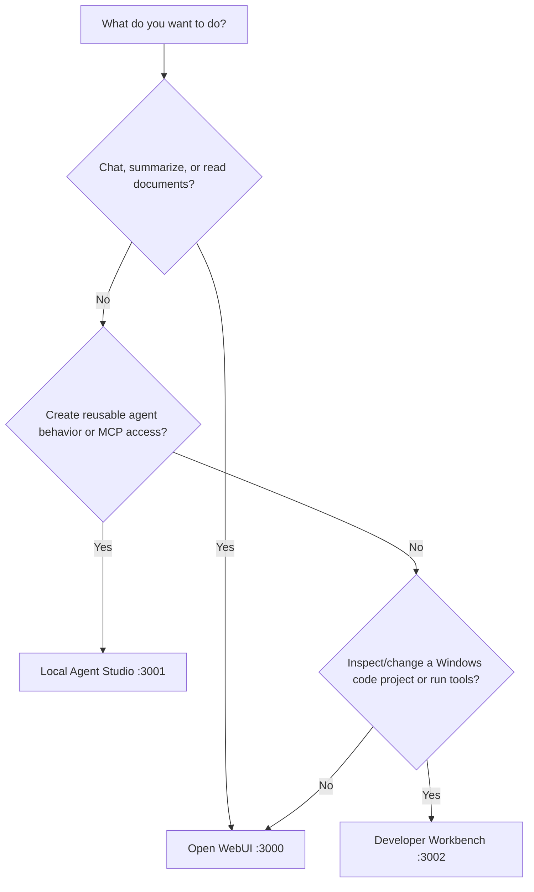

# DSAlgo Local AI Setup User Guide

This guide explains how to install, start, use, maintain, repair, and remove
DSAlgo Local AI Setup. It assumes you are comfortable opening PowerShell, but it
does not assume Docker, WSL, Ollama, Git, or AI-agent experience.

## Installer model preferences

Choose General Conversation, Reasoning, Coding, Deep Research, or All. Ollama
is always the local runtime. Comfortable preserves more capacity for Windows,
Docker Desktop, browsers, and development tools; Aggressive permits larger
compatible models with less headroom.

Provenance is optional. None disables and ignores organization/country
filters. Prefer raises matching models, Avoid lowers them, and Require only
permits a model matching the selected organization or country. Require needs
at least one specific selection. After confirmation, setup downloads the
chosen models and creates enabled sample general, coding, and research agents.

The recommendation table marks whether each candidate fits general
conversation, coding, reasoning, document work, or all four categories.
Select at least one and no more than three models. The displayed HDD estimate
includes the selected conversational models and embedding support. Models stay
downloaded, but setup is configured to keep only one conversational model
actively loaded when practical.

Developers changing the source should use [dev-guide.md](dev-guide.md).

## Current support and release confidence

The supported starting point is Windows 11 with WSL2, Docker Desktop, native
Windows Ollama, a known NVIDIA CUDA GPU with dedicated VRAM, and sufficient
RAM and disk. Other hardware and operating-system paths are validation work,
not promises. Current estimates do not yet block every insufficient-disk or
late Docker/WSL failure before downloads begin, so treat installation and
lifecycle recovery as controlled-beta and validate post-install health.

Open WebUI is the chat/documents surface, Agent Studio configures agents and
MCP, and Developer Workbench is the higher-trust approved-project coding
surface. A raw Ollama model is not the same as a configured gateway agent;
Workbench tasks require an enabled agent with a valid backing model.

## 1. What this project gives you

After installation you have three main browser applications:

| Application | Address | Use it for |
|---|---|---|
| Open WebUI | `http://localhost:3000` | Chatting, selecting local models or agents, attaching documents, and reusable knowledge |
| Local Agent Studio | `http://localhost:3001` | Creating agents, choosing their tools, and connecting trusted MCP servers |
| Developer Workbench | `http://localhost:3002` | Letting an AI inspect or modify approved Windows projects, reviewing patches, running commands, and using Git |

Two supporting services normally stay in the background:

- Agent Gateway at `http://localhost:8001` connects Open WebUI to configured
  agents and tools.
- OAuth broker at `http://localhost:3003` securely handles browser
  authorization for compatible MCP servers.

Ollama runs directly on Windows at `http://localhost:11434` and uses the NVIDIA
GPU. Most other services run inside Docker Desktop.

## 2. Important safety expectations

This is a single-user local workstation setup, not a public internet service.

- Do not expose its ports through your router or a public network.
- Review every Workbench patch and command before approving it.
- Use the narrowest possible project directory.
- Do not put passwords or API keys into agent instructions or ordinary JSON
  headers.
- Connect only MCP servers you trust.
- Commit or back up your own code projects separately. Project backup does not
  copy them.
- Strict Offline is an application policy, not a Windows firewall. Use Windows
  firewall or disconnect the network for machine-wide isolation.

## 3. Usage prerequisites

### Hardware

The currently validated path targets Windows 11 machines with a known NVIDIA
CUDA GPU and dedicated VRAM, adequate system RAM and disk, WSL2, Docker
Desktop, and native Ollama. The catalog can recommend smaller configurations
for other hardware, but AMD, Intel, CPU-only, Vulkan, DirectML, unknown-VRAM,
multi-GPU, and non-Windows paths remain controlled beta and require manual
validation. Model thresholds are conservative estimates rather than
performance guarantees.

The installer performs deterministic hardware detection and catalog scoring; it
does not use AI inference. Repeatable output is not a guarantee that drivers,
backend support, disk capacity, model availability, or throughput will match
the estimate. Free disk is displayed but is not yet a hard eligibility gate;
CPU core count and performance class are not yet used in eligibility, and
Docker/WSL limits are not fully derived from every machine's hardware.

### Windows requirements

- Windows 11
- Administrator access for installation, repair, and the container-start phase
- Internet access during the first installation to download applications,
  images, and models
- Hardware virtualization enabled in firmware
- Windows Package Manager (`winget`)

The installer adds missing supported prerequisites. You do not have to manually
install WSL, Python, Ollama, or Docker Desktop first.

### Before installation

1. Save open work. Windows may need to restart.
2. Connect the laptop to power.
3. Use a reliable internet connection.
4. Keep at least several dozen gigabytes of disk space available.
5. Close applications that are using large amounts of GPU memory.

## 4. First installation

### Step 1: Open the release package

The public release package contains `install.exe`, `start.exe`, `stop.exe`,
`repair.exe`, `remove.exe`, and `uninstall.exe`. Extract it to a local
directory; do not run executables from inside the compressed archive.

Administrator access is required to enable Windows features and install system
applications. Developer Workbench itself does not run as Administrator.

### Step 2: Run the installer

Right-click `install.exe` and choose **Run as administrator**. Follow the
single installer window, accept the displayed `LICENSE` and third-party
notice, review hardware, choose model preferences, and confirm installation.
No repository checkout or PowerShell execution-policy change is required.

The installer:

1. Checks that it is running as Administrator.
2. Enables the Windows Subsystem for Linux and Virtual Machine Platform if
   required.
3. Saves installation progress before any required restart.
4. Installs or updates the WSL package and selects WSL2.
5. Installs Python, Ollama, and Docker Desktop when they are missing.
6. Backs up an existing `.wslconfig`, preserves its existing values, and merges
   only missing DSAlgo settings. If the file contains conflicting, duplicate,
   or unparseable settings, the installer explains the issue and lets you
   continue with preserved values or abort to remediate it first.
7. Shuts down WSL so the new resource limits take effect.
8. Starts Docker Desktop and waits until Docker is ready.
9. Creates `.env` with generated local credentials and converts the Windows
   system time zone to the IANA identifier used by Linux containers. Existing
   user-selected `.env` values are preserved on later runs.
10. Pulls the configured Ollama models unless `-SkipModels` is used.
11. Builds the local project images.
12. Creates containers but intentionally leaves the application stopped.
13. Creates Desktop shortcuts for Install, Repair, and Start.
14. Creates a **DS_ALGO Local AI** Start Menu folder with lifecycle shortcuts.

### If Windows asks for a restart

The installer exits with its progress saved. Restart Windows, sign in, reopen
sign in again, and launch `install.exe` from the extracted release directory.

The installer is designed to resume. Do not delete `runtime/install-state.json`
between runs.

To allow the installer to initiate the required restart:

The installer resumes from its recorded state. Do not delete the `runtime`
directory between runs.

## 5. Installation choices

This public release installs the core local-AI stack only: native Ollama,
Open WebUI, Agent Gateway, Agent Studio, the native Developer Workbench, and
the native OAuth broker are part of this installer path. Optional workflow,
database, cache, and vector services are not installed by the core setup.

### Skip model downloads

Model downloads are selected in the installer wizard. The wizard shows model
fit and estimated storage before downloading anything; leave a model
unselected when it should not be installed.

### Use preserved personal configuration

The public/default setup contains no custom agents, MCP servers, or approved
projects. If this machine has ignored `config/personal-*` snapshots:

Personal configuration snapshots are an advanced developer/recovery feature
and are not part of the public release workflow. Passwords and tokens remain
in DPAPI or runtime files.

## 6. Starting the system

Use the **DSAlgo Local AI Setup - Start** Desktop or Start Menu shortcut, or
double-click `start.exe` in the installed release directory.

Windows shows a UAC prompt. That elevated phase starts Docker and container
services. The original normal-user process then starts Developer Workbench and
the OAuth broker without Administrator privileges.

The launcher starts services and opens Open WebUI, Local Agent Studio, and
Developer Workbench in a browser window.

## 7. Stopping, repairing, removing, and uninstalling

### Workbench tool-call and step-limit behavior

Goal tasks use the selected agent's configured maximum tool-step count (up to a
defensive cap of 1000). A large value only permits more turns; it does not
force completion. For safety, the Workbench executes edits and commands only
when Ollama returns a structured approval-gated tool call. If a model writes a
command in ordinary response text instead, no command is run and the task is
reported as incomplete or blocked. Install the missing dependency or rerun the
task with an agent/model that reliably supports tool calls.

These commands deliberately do different things.

### Stop and keep everything

Double-click `stop.exe` or use its installed shortcut.

This stops services but keeps containers, images, volumes, models,
configuration, and project data.

### Repair without starting

Run from Administrator PowerShell:

Double-click `repair.exe` or use its installed shortcut. Approve elevation if
requested.

Repair stops native services, rebuilds images, recreates the selected
containers, refreshes shortcuts, and leaves everything stopped. Run
`start.exe` afterward when you are ready.

### Remove project containers

Double-click `remove.exe` or use its installed shortcut.

Type `REMOVE` when prompted. This removes project containers and services but
keeps persistent volumes, models, configuration, source files, and approved
external project directories.

### Permanently uninstall

Run from Administrator PowerShell:

Double-click `uninstall.exe` or choose **Uninstall** from the installed Start
Menu folder. Approve elevation if requested.

Type `UNINSTALL` when prompted. Uninstall removes project containers, locally
built project images, shortcuts, and applications recorded as installed by this
installer.

The wizard presents an unchecked **Permanently remove installer-owned
Docker images, volumes, and downloaded models** option. Selecting it is
equivalent to selecting the model/data cleanup options. Leave it unchecked to
retain reusable models and Docker data.

- `-RemoveModels` deletes models recorded as pulled by this installer.
- `-RemoveData` deletes project Docker volumes, generated credentials, runtime
  state, and personal configuration snapshots.
- `-RemoveWindowsFeatures` disables WSL-related features only when the install
  record proves this project enabled them.

The source directory and every external project registered in Workbench are
intentionally retained.

## 8. Checking health

With services running:

```powershell
.\Health.ps1
```

For a broader local AI check:

```powershell
.\Test-LocalAI.ps1
```

For a quick hardware/model calibration:

```powershell
.\Benchmark.ps1 -Quick
```

If a check fails, note which service failed before running Repair. A stopped
system is not unhealthy; it is simply not running.

## 9. Choosing the right interface



- Use Open WebUI for normal conversations and documents.
- Use Studio to configure a reusable agent; return to Open WebUI to chat with
  that agent.
- Use Workbench for actual local code changes, Windows commands, patch review,
  and Git.

## 10. Using Open WebUI

### Image questions with local agents

Image questions sent through an Agent Gateway agent require a vision-capable
Ollama model, such as a configured Gemma vision variant. The gateway accepts
local base64 image attachments and rejects remote image URLs by design. If an
attachment cannot be normalized, Open WebUI should display the returned error;
select a supported vision model or use a text-only prompt. Vision capability,
quality, and resource use remain model-specific and are not guaranteed merely
because a model is downloadable.

The gateway also extracts text from local TXT, Markdown, CSV, PDF, and DOCX
attachments sent as base64 file blocks. Documents are limited to 20 MB and
extracted text to approximately 2 million characters. Scanned PDFs without a
text layer, legacy binary `.doc` files, remote URLs, and unsupported file blocks
are rejected with an actionable error. Document extraction is bounded and does
not execute macros, embedded files, or document links.

An agent with the `http_get` permission can fetch public HTTP/HTTPS text or JSON
through the gateway. The permission exposes a controlled tool; it does not give
the model unrestricted browsing. For current or external facts, the gateway
instructs the model to call `http_get`; private addresses and unsupported
responses remain blocked. In Restricted Online and Strict Offline modes the
tool is unavailable by policy.

Open `http://localhost:3000`.

### First sign-in

Open WebUI creates its own local account. On a new data volume, create the first
account shown by the interface. Do not expose the page publicly.

### Selecting a local model

At the top of a new chat, open the model picker and choose a local Ollama tag:

- `qwen3:14b-q4_K_M` for general chat and tool-capable work;
- `qwen2.5-coder:14b-instruct-q4_K_M` for coding;
- `deepseek-r1:14b-qwen-distill-q4_K_M` for reasoning/review;
- `embeddinggemma:latest` for embeddings, not ordinary conversation.

Selecting a raw local model sends the request to Ollama on this machine.

### Selecting an agent

The model picker also shows external-style entries served by the local gateway:

- General Agent;
- Coding Agent;
- Reasoning Agent;
- Multi-Agent Orchestrator;
- custom agents created in Studio.

They appear under “External” because Open WebUI sees the local gateway as an
OpenAI-compatible external connection. That label does not mean cloud-hosted.

The selected item shown above each assistant reply tells you which model or
agent answered.

### “Unloads in a few minutes”

The green dot means an Ollama model is currently loaded in memory. “Unloads in
4 minutes” means Ollama plans to release it after inactivity. Your model files
remain installed; only RAM/VRAM is released.

### Starting a general chat

1. Select `qwen3` or General Agent.
2. Enter a question.
3. Review the selected model shown with the response.
4. Start a new chat if you need a clean context.

Example:

```text
Explain the difference between an event-driven architecture and a request-
response architecture. Give a practical Java example.
```

### Reading a document

1. Start a new chat.
2. Choose a general or reasoning model.
3. Use the attachment button.
4. Select the document.
5. Ask a specific question.

Example:

```text
Summarize this document for a developer. List the requirements, unresolved
questions, risks, and acceptance criteria. Cite the relevant sections.
```

Do not use the embedding model as the chat model.

### Building reusable document knowledge

Use Open WebUI **Workspace → Knowledge** when a collection should be searched
across many chats:

1. Create a knowledge collection.
2. Upload related documents.
3. Wait for indexing.
4. Attach or select the collection in a chat.
5. Ask source-specific questions and verify citations.

One-off attachments are simpler when the document is needed only once.

### Why Workspace → Models can show zero

That page lists Open WebUI model presets, not installed Ollama models. Installed
models still appear in the chat model picker. Create a preset only when you want
a saved Open WebUI prompt or model wrapper.

## 11. Using Local Agent Studio

Open `http://localhost:3001`.

Studio configures agents; it is not the normal chat interface.

### Creating an agent

1. Select **Agents**.
2. Choose **New agent**.
3. Enter a clear display name.
4. Choose the model role:
   - `general` for broad tasks and tool use;
   - `coder` for code and structured modifications;
   - `reasoning` for review and analysis.
5. Set maximum tool steps. Start around 4–8; higher values allow more tool
   calls but take longer and increase risk.
6. Write precise instructions describing purpose and boundaries.
7. Enable only required tools.
8. Select trusted MCP servers only if required.
9. Enable the agent.
10. Save changes.

Studio automatically assigns user-created IDs beginning with `my-custom-`.
Display names begin with “My Custom —”. IDs are stable machine identifiers;
display names are the human-readable labels shown in UIs.

### Tool permissions

| Tool | What it permits |
|---|---|
| `calculate` | Evaluate bounded arithmetic |
| `get_datetime` | Read current date/time |
| `http_get` | Fetch an allowed web URL in Online mode |
| `workspace_list` | List files under the container workspace |
| `workspace_read` | Read workspace files |
| `workspace_search` | Search workspace text |
| `workspace_write` | Create or modify workspace files |
| `workspace_delete` | Delete workspace files |
| `run_command` | Run an allowed command inside the gateway workspace |

Use least privilege. A research agent usually needs read and web tools, not
delete or command execution. Container workspace tools cannot access arbitrary
Windows projects; use Workbench for those.

### Example general research agent

```text
Display name: My Documentation Researcher
Model role: general
Maximum tool steps: 6
Instructions: Answer using assigned documentation tools. Distinguish retrieved
facts from inference and say when the source does not answer the question.
Tools: calculate, get_datetime
MCP: only the required documentation server
```

### Example coding workspace agent

```text
Display name: My Workspace Coder
Model role: coder
Maximum tool steps: 8
Instructions: Inspect before editing. Make only scoped changes and report every
file changed and validation command run.
Tools: workspace_list, workspace_read, workspace_search, workspace_write,
run_command
```

## 12. Connecting an MCP server

MCP servers extend an agent with provider-defined tools or data. They may send
your questions or selected content to another service.

### Add a Streamable HTTP server

1. Open Studio and select **MCP Servers**.
2. Choose **Add MCP server**.
3. Enter a unique server ID such as `product-docs`.
4. Enter a descriptive name.
5. Enter the provider’s HTTPS Streamable HTTP URL.
6. Set a timeout, usually 30–60 seconds.
7. Select authentication:
   - None for a public server;
   - OAuth 2.1 for a compatible protected server.
8. Add OAuth scopes only when the provider requires them.
9. Put only non-secret headers in the header JSON.
10. Enable the server and save.
11. Use **Test connection**.

A successful test proves initialization and current authentication. It does not
prove that every tool, scope, or future call will work.

### OAuth connection

1. Start the system normally so the OAuth broker is running.
2. Save the MCP server with OAuth selected.
3. Choose **Connect OAuth**.
4. Complete the provider’s browser page.
5. Return to Studio.
6. Choose **OAuth status**.
7. Test the connection.
8. Assign the server to an agent.
9. Save the agent.
10. Select that agent in a new Open WebUI chat.

OAuth works only in Online mode. Providers without compatible discovery,
dynamic registration, PKCE, or refresh behavior may require provider-specific
work.

### Static secret headers

Never type API keys into non-secret header JSON. Store a protected value:

```powershell
.\Set-McpSecret.ps1 -Name 'productDocsApiKey'
```

Then reference that name through the supported `secretHeaders` configuration.
The value is encrypted using Windows DPAPI and tied to the current Windows user.

## 13. Using Developer Workbench

Open `http://localhost:3002`.

Workbench can access only directories you explicitly register.

### Add an approved project

1. Select **Projects**.
2. Choose **Add project**.
3. Enter a human-friendly name.
4. Enter the absolute existing Windows directory, such as:

   ```text
   C:\dev\my-project
   ```

5. Prefer the Git repository root rather than a drive, home folder, or broad
   parent directory.
6. Confirm the project appears in the approved list.

Removing a Workbench project registration never deletes its files.

### Create a change task

1. Select **Tasks**.
2. Choose the approved project.
3. Choose an enabled sample or custom agent. Its configured backing Ollama
   model, preferred-use role, tools, and maximum tool-step budget are used;
   there is no legacy role-only fallback.
4. Choose a work mode: **Ask** (read and answer only), **Plan** (read and save
   a unique timestamped Markdown plan under `.workbench-plans`), or **Goal**
   (continue approval-gated work until verified complete or blocked).
5. Write a focused request.
6. Choose **Start task**.
7. Watch events and approval requests.
8. Review every proposed patch or command.
9. Approve only what matches the request.
10. Inspect the final changed-file list, tests, output, and diff.

Recommended prompt:

```text
Objective:
Add validation for empty customer names.

Constraints:
Preserve the public API and existing formatting.

Acceptance criteria:
- Empty and whitespace-only names are rejected.
- Existing valid requests still work.
- Error handling follows the current project pattern.

Tests to run:
mvn test

Likely files:
CustomerController and its unit tests.
```

### Running Windows commands

Workbench can request approved PowerShell, Maven, Gradle, npm, .NET, Docker,
Git, and other installed executable commands. The executable must already exist
on Windows and be visible to the non-Administrator Workbench process.

A command approval is permission to run it, not proof it is safe. Read the full
command, directory, and stated impact.

Approval cards require structured `tool_calls` from Ollama. A command or patch
written only as ordinary assistant prose is never executed. Goal mode continues
after partial progress, but repeated no-tool responses or missing-dependency
requests become an actionable blocker. The selected agent's `maxSteps` is a
safety budget capped at 1000, not a completion guarantee.

The Workbench validates tool names and arguments before execution and can repair
a small set of unambiguous argument-name differences used by local models. A
malformed request is returned to the model for correction up to three times;
continued incompatibility ends as `incomplete` with the protocol error shown.
Goal tasks require verification after their last approved change and reject
unchanged or suspicious whole-file replacement proposals. These controls make
model behavior bounded and reviewable, but they do not guarantee that every
downloadable model can complete coding tasks.

Goal mode does not treat success-text as evidence. Commands that only print a
completion claim are rejected, including semantically equivalent wording. The
progress budget advances only for real mutations, recognized verification
commands, or post-change inspection. Tasks that request compilation, builds, or
tests must show a successful matching command (or remain explicitly blocked);
`git diff` alone cannot complete them. One missing-verification repair is
requested before the task is marked incomplete.

### Reviewing patches

Check:

- correct file paths;
- only intended files changed;
- no credentials or local machine paths added;
- no unrelated formatting churn;
- deletions are intentional;
- tests cover the behavior;
- command output actually shows success.

Reject the proposal if it is too broad. Create a narrower follow-up task.

### Git workflow

1. Select **Git** and the approved project.
2. Inspect **Status**.
3. Create or switch to a feature branch.
4. Review **Working diff**.
5. Run the appropriate tests.
6. Check for unrelated pre-existing changes.
7. Enter a clear commit message.
8. Use **Stage all and commit** only when every working-tree change belongs in
   the commit.
9. Review the result.
10. Use **Push current branch** only after confirming the remote impact.

Workbench does not provide per-file or per-hunk staging. Use normal Git tools
when you need selective staging, history rewriting, conflict resolution, or a
pull request.

## 14. Operating modes

The mode selector in Studio and Workbench controls one shared setting.

### Online

Use when external MCP, OAuth, agent HTTP access, package downloads, remote Git,
and all configured connectivity are permitted.

### Restricted Online

Use when AI data must remain local but development still needs package
registries, builds, Docker, or remote Git.

Disabled:

- agent `http_get`;
- external MCP calls;
- OAuth network actions;
- external LLM access through project-controlled agent paths.

Still potentially online:

- Maven, Gradle, npm, NuGet, Docker, project scripts, and Git.

### Strict Offline

Use when project-controlled external connectivity should be blocked.

Disabled:

- everything disabled by Restricted Online;
- remote Git actions;
- arbitrary commands whose network behavior cannot be bounded;
- package and image download workflows through controlled interfaces.

Downloaded models, local files, local Git inspection, and ordinary local
inference remain usable.

Turning Online back on restores the configured capabilities; mode changes do
not erase agent, MCP, project, or model settings.

## 15. Models and resource use

The repository includes a valid bootstrap registry so tools can parse the
expected schema before installation. It is installer-managed: `install.exe`
replaces the hardware profile and selected model values deterministically
before services start. The entries below are fallback defaults in the source
template, not a guarantee that these models will be installed:

| Role | Default model | Typical use |
|---|---|---|
| General | Qwen3 14B Q4_K_M | Chat, tools, planning |
| Coder | Qwen2.5-Coder 14B Q4_K_M | Code analysis and edits |
| Reasoning | DeepSeek-R1 Distill Qwen 14B Q4_K_M | Review and difficult reasoning |
| Embedding | EmbeddingGemma | Document indexing |

Models unload after their keep-alive timeout to release RAM/VRAM. Switching
between the orchestrator’s roles can take longer because different models may
load sequentially.

Default WSL profiles:

- Balanced: Docker memory 20 GB, 8 processors, 8 GB swap.
- AI-only: Docker memory 28 GB, 12 processors, 8 GB swap.

Change profile:

```powershell
.\Configure-WSL.ps1 -Profile AIOnly
wsl --shutdown
```

Restart Docker Desktop afterward.

## 16. Personal configuration and Git safety

Public tracked configuration is generic. Machine-specific non-secret snapshots
use:

```text
config\personal-agents.json
config\personal-models.json
config\personal-projects.json
config\personal-runtime-policy.json
```

They are ignored by Git. So are `.env`, DPAPI stores, runtime state, backups,
logs, and benchmark output.

Before publishing:

```powershell
.\Test-GitSafety.ps1
```

If the directory is not yet a Git repository, the script validates only what it
can and explains that tracked-file inspection was skipped.

## 17. Backup and restore

Create a backup:

```powershell
.\Backup.ps1
```

The normal backup includes Open WebUI data, model/agent configuration, approved
project registration, operating mode, and the container-agent workspace.

It excludes:

- `.env`;
- DPAPI secrets and OAuth tokens;
- decrypted runtime secrets;
- Workbench task history;
- contents of external approved projects;
- production-grade database dumps.

Restore using the documented `Restore.ps1` options, then run Repair and Start
as appropriate. Do not run destructive restore against valuable active data
without reviewing the selected backup.

## 18. Logs and important locations

| Location | Contents |
|---|---|
| `logs/developer-workbench.log` | Workbench lifecycle and requests |
| `logs/oauth-broker.log` | OAuth broker lifecycle with redaction |
| `runtime/developer-workbench/` | PID, browser token, task history, output |
| `runtime/oauth-broker/` | PID and local broker authentication token |
| `config/agents.json` | Active agent and MCP definitions |
| `config/projects.json` | Approved Workbench roots |
| `config/runtime-policy.json` | Shared mode |
| `config/models.json` | Model roles and settings |
| `workspace/` | Files available to container gateway tools |

Runtime files can contain sensitive prompts, paths, command output, or tokens.
Do not publish them.

## 19. Troubleshooting

### Docker Desktop does not start

1. Restart Windows if WSL features were just enabled.
2. Start Docker Desktop manually.
3. Wait for its engine-ready indicator.
4. Run:

   ```powershell
   docker info
   ```

5. Rerun Install, Repair, or Start.

### WSL changes do not take effect

```powershell
wsl --shutdown
```

Then fully restart Docker Desktop.

### Agent Studio or Open WebUI is unavailable

Use the installed `repair.exe` shortcut to rebuild the stack and the
`start.exe` shortcut to bring services online.

If containers are missing or built from old source:

Double-click `repair.exe`, wait for it to finish, then double-click `start.exe`.

If the Studio or Workbench logo is broken or its browser-tab icon is missing,
run Repair so the updated backend and static files are installed, start the
system, then perform a hard browser refresh with `Ctrl+F5`. Browsers may cache
favicons separately from ordinary page content.

### Developer Workbench is unavailable

Run Start from a normal PowerShell window, not Administrator:

```powershell
.\Start-DeveloperWorkbench.ps1 -OpenBrowser
```

Review `logs/developer-workbench.log` and
`runtime/developer-workbench/stderr.log`.

If the error says that a list has no `get` attribute, confirm that
`config/projects.json` uses this object shape:

```json
{
  "projects": []
}
```

Do not replace it with a bare `[]`.

### OAuth authorization succeeds but an agent cannot use MCP

1. Confirm Online mode.
2. Save the MCP server.
3. Check OAuth status.
4. Test the connection.
5. Confirm the MCP server is enabled.
6. Confirm it is assigned to the selected enabled agent.
7. Start a new Open WebUI chat using that agent.
8. Ask explicitly to use the MCP tool and cite retrieved sources.

Authentication success does not guarantee an agent assignment or usable scope.

### An MCP answer uses general knowledge

Require retrieved evidence:

```text
Use the configured documentation MCP server. If the tool is unavailable or
returns no relevant source, say so and do not answer from general knowledge.
List the retrieved sources.
```

### Ollama is unavailable from containers

1. Confirm Ollama is running on Windows.
2. Open `http://localhost:11434/api/tags`.
3. Confirm `.env` uses
   `OLLAMA_URL=http://host.docker.internal:11434`.
4. Check Docker Desktop host networking.
5. Restart the stack.

### Models are slow or use CPU

- Close other GPU-heavy applications.
- Run `nvidia-smi`.
- Keep one generation model active.
- Reduce context length or concurrency.
- Stop optional Docker profiles.
- Run `Benchmark.ps1 -Quick`.

### Workbench refuses a project path

Use an existing absolute directory that is not a drive root. Avoid broad roots
such as `C:\`, your whole user profile, or a directory containing unrelated
repositories.

### A Git commit would include unrelated files

Do not use Stage all and commit. Use normal Git commands or another Git client
to stage selected files, then return to Workbench for inspection.

## 20. Suggested beginner workflows

### Ask a private local question

1. Start the system.
2. Open Open WebUI.
3. Select Qwen3.
4. Ask the question.
5. Confirm the reply names the selected local model.

### Summarize a document

1. Open a new Open WebUI chat.
2. Select Qwen3 or the reasoning model.
3. Attach the document.
4. Ask for a structured summary and citations.
5. Verify important facts against the source.

### Create a reusable documentation agent

1. Add and test a trusted MCP server in Studio.
2. Create a general agent with narrow instructions.
3. Assign only that MCP server and required tools.
4. Save and enable the agent.
5. Start a new Open WebUI chat using it.
6. Require retrieved citations.

### Safely modify a Java project

1. Ensure the project is committed or backed up.
2. Register its Git root in Workbench.
3. Create a feature branch.
4. Start a coder task with acceptance criteria and `mvn test`.
5. Review and approve only scoped changes/commands.
6. Inspect status and working diff.
7. Run tests.
8. Commit only after checking for unrelated changes.
9. Push only after confirming the branch and remote impact.

### Work locally while builds remain online

1. Set Restricted Online in either Studio or Workbench.
2. Use downloaded Ollama models.
3. Run approved Maven/npm/.NET/Docker/Git workflows as needed.
4. Do not assume those build tools are offline.
5. Return to Online only when external AI or MCP access is required.

## 21. Getting deeper technical information

- Architecture, APIs, diagrams, source layout, testing, and development:
  [dev-guide.md](dev-guide.md)
- Known limitations:
  [to-do.md](to-do.md)
- Accepted decisions:
  [decision-log.md](decision-log.md)
- Security posture:
  [SECURITY.md](SECURITY.md)
### License confirmation

The first installer page displays `LICENSE` and a notice about third-party
software and models. Select the confirmation checkbox to continue. Declining
or closing the page makes no machine changes.
